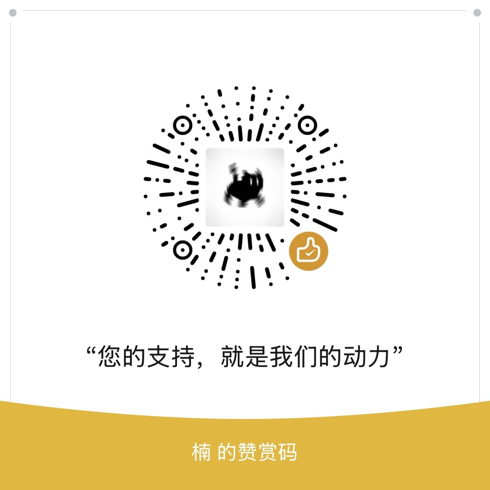

<p align="center">
  
</p>

<h1 align="center">楠枫API计费系统</h1>

<p align="center">
  <strong>稳定、清晰、可运营的 API 服务平台</strong>
</p>

<p align="center">
  
  
  
  
  
  
  
  <a href="https://api.nfiii.com" target="_blank"></a>
</p>

---

## 📖 项目简介

**楠枫API计费系统** 是一套完整的 API 开放平台解决方案，面向第三方 API 的聚合、计费与运营管理。系统支持多层级计费模型（套餐 / 点数 / 余额）、上游轮询负载均衡、支付宝全产品支付（电脑网站 / 手机网站 / 当面付），提供用户端 API 商城、开放网关、密钥管理与管理端全功能后台。

> 统一管理接口、Key、套餐、计费与调用日志，帮助您快速搭建可运营的 API 服务平台。

🔗 **演示地址**：[https://api.nfiii.com](https://api.nfiii.com)
🐧 **作者QQ**：[26536113](26536113)
---

## ✨ 核心功能

### 🔌 API 管理与聚合
- 完整的接口 CRUD，支持 GET / POST / GET_POST 多种请求方式
- **上游轮询负载均衡**：支持普通轮询（ROUND_ROBIN）、主备模式（PRIMARY）、单节点（SINGLE）
- 每个上游节点可独立配置响应 JSON 字段校验（如 `code=200`），校验失败自动切换
- 接口置顶与精选（首页展示）
- 公开接口文档生成（请求参数、返回字段、状态码、响应示例）

### 💰 多层级计费引擎
- **全站套餐**：有效期 + 日调用量 + QPS 限制
- **接口套餐**：多规格（名称 / 价格 / 天数 / 日上限 / QPS）
- **点数套餐**：购买点数按次消费
- **余额直扣**：按接口定价实时扣费
- 扣费优先级：全站套餐 → 接口套餐 → 点数 → 余额
- 灵活的扣费规则引擎：支持按响应字段 + 运算符（EQ / NE / GT / LT / CONTAINS）判断是否计费

### 🔑 密钥与安全
- 接口级（INTERFACE）和全站级（GLOBAL）两种密钥范围
- IP 白名单管理（支持换行 / 逗号分隔）
- 滑块验证码（SHA-256 工作量证明）
- JWT 双令牌认证（Access Token 30min + Refresh Token 7d）
- Redis 多层限流：登录、注册验证码、API 调用 QPS / 日量

### 💳 支付宝支付集成
- 从零实现的 RSA2 签名与验签
- 支持 PAGE（电脑网站）、WAP（手机网站）、FACE（当面付扫码）三种支付产品
- 充值金额预设管理（支持赠送金额）
- 订单状态追踪与支付宝异步通知回调

### 📊 调用日志与数据分析
- 全字段异步记录：请求参数、上游地址、响应内容、耗时
- 客户端 IP 归属地解析（国家 / 省 / 市 / 运营商）
- 计费明细：计费类型、扣费来源、扣费层级、规则快照
- 首页概览：调用趋势图、地区排行、热门 API

### 👥 用户与管理
- 邮箱 + 手机号（阿里云短信）双通道注册
- 注册频率限制（分钟 / 小时 / 天）
- RBAC 权限模型：角色 → 菜单 → 按钮权限码
- 管理员可为用户配置"指定返回"（自定义响应，不调用上游）

### 📝 内容运营
- 系统公告（富文本，支持置顶与每日弹窗）
- 首页滚动公告
- 友情链接申请与审核（PENDING → APPROVED / REJECTED）
- 站点配置单例管理（Logo、联系方式、ICP 备案、版权）

---

## 🏗️ 技术栈

| 层次 | 技术 | 版本 |
|------|------|------|
| **后端框架** | Spring Boot | 3.3.5 |
| **语言** | Java | 17 |
| **ORM** | MyBatis-Plus | 3.5.9 |
| **数据库** | MySQL | 8.0 |
| **缓存 / 限流** | Redis | 7.0 |
| **安全** | Spring Security + JWT (jjwt) | 0.12.6 |
| **工具库** | Hutool | 5.8.35 |
| **短信** | 阿里云 Dypnsapi | 2.0.0 |
| **前端框架** | Vue (Composition API) | 3.5.32 |
| **构建工具** | Vite | 8.0.8 |
| **UI 组件库** | Ant Design Vue | 4.2 |
| **CSS** | Tailwind CSS | 4.2 |
| **语言** | TypeScript | 6.0 |
| **状态管理** | Pinia | 3.0 |
| **路由** | Vue Router | 5.0 |
| **图表** | ECharts | 6.0 |
| **HTTP 客户端** | Axios (Vben Request) | 1.15 |
| **国际化** | Vue I18n | 11.3 |
| **包管理** | pnpm + Turborepo | monorepo |

---

## 📐 系统架构

```
┌─────────────────────────────────────────────────────────┐
│                      用户层                               │
│   Web 管理端 (Vben Admin)  │  API 商城 (公开)  │  移动端   │
└──────────────────────┬──────────────────────────────────┘
                       │  HTTP / HTTPS
                       ▼
┌─────────────────────────────────────────────────────────┐
│                   Spring Boot 后端                         │
│  ┌─────────┐ ┌──────────┐ ┌───────────┐ ┌───────────┐  │
│  │ Auth    │ │ 接口管理  │ │ 套餐 / 计费│ │ 支付模块  │  │
│  │ JWT认证 │ │ 轮询转发  │ │ 扣费规则   │ │ 支付宝    │  │
│  └─────────┘ └──────────┘ └───────────┘ └───────────┘  │
│  ┌─────────┐ ┌──────────┐ ┌───────────┐ ┌───────────┐  │
│  │ 密钥管理│ │ 用户管理  │ │ 内容运营   │ │ 调用日志  │  │
│  │ IP白名单│ │ RBAC权限  │ │ 公告/友链  │ │ IP归属地  │  │
│  └─────────┘ └──────────┘ └───────────┘ └───────────┘  │
└──────────────────────┬──────────────────────────────────┘
                       │
          ┌────────────┼────────────┐
          ▼            ▼            ▼
     ┌────────┐ ┌──────────┐ ┌──────────┐
     │ MySQL  │ │  Redis   │ │ 第三方API │
     │33张表   │ │ 缓存/限流│ │ (上游服务)│
     └────────┘ └──────────┘ └──────────┘
```

### 计费扣费链路

```
用户请求 → API 网关
  → ① 校验密钥 + IP 白名单 + 用户状态
  → ② 检查指定返回配置
  → ③ 配额检查（全站套餐 → 接口套餐 → 点数 → 余额）
  → ④ 转发上游（轮询 / 故障切换）
  → ⑤ 扣费规则匹配（字段 + 运算符 + 期望值）
  → ⑥ 异步写入调用日志
  → ⑦ 返回响应 + 计费信息头
```

---

## 🚀 快速开始

### 环境要求

- **JDK** 17+
- **MySQL** 8.0+
- **Redis** 7.0+
- **Node.js** 20+
- **pnpm** 10+

### 1. 克隆项目

```bash
git clone https://github.com/your-username/nanfeng-api-billing.git
cd nanfeng-api-billing
```

### 2. 初始化数据库

```bash
mysql -u root -p < backend/src/main/resources/db/schema.sql
```

默认管理员账号：`nanfeng`，密码：`123456`

### 3. 配置后端

编辑 `backend/src/main/resources/application.yml` 或通过环境变量配置：

```bash
# 环境变量（推荐生产使用）
export DB_HOST=localhost
export DB_PORT=3306
export DB_NAME=nanfeng_api_billing
export DB_USER=root
export DB_PASSWORD=your_password
export REDIS_HOST=localhost
export REDIS_PORT=6379
export REDIS_PASSWORD=
export JWT_SECRET=your_jwt_secret_key
```

### 4. 启动后端

```bash
cd backend
./mvnw spring-boot:run
```

后端启动后运行在 `http://localhost:8080/api`

### 5. 配置前端

```bash
cd vben-admin
pnpm install
```

编辑 `playground/.env.development`，确保 API 代理指向后端：

```
VITE_GLOB_API_URL=http://localhost:8080/api
```

### 6. 启动前端

```bash
pnpm dev:play
```

### 7. 构建前端

```bash
pnpm --filter @vben/playground build
```


前端启动后访问 `http://localhost:5555`

---

## 📁 项目结构

```
nanfeng-api-billing/
├── backend/                          # Spring Boot 后端
│   ├── src/main/java/com/nanfeng/billing/
│   │   ├── controller/               # 18个 REST Controller（120+ API）
│   │   ├── service/                  # 12个 Service 类
│   │   ├── security/                 # JWT 认证与 Spring Security 配置
│   │   ├── config/                   # 异步、CORS、文件上传等配置
│   │   ├── entity/                   # MyBatis-Plus 实体（RBAC）
│   │   ├── mapper/                   # MyBatis-Plus Mapper
│   │   ├── model/                    # DTO / VO 数据传输对象
│   │   └── common/                   # 统一响应、异常处理、URL模板引擎
│   └── src/main/resources/
│       ├── application.yml           # 主配置文件
│       └── db/schema.sql             # 33张表的完整建表脚本 + 初始数据
├── vben-admin/                       # Vue Vben Admin 前端（monorepo）
│   ├── apps/
│   │   ├── web-antd/                 # Ant Design Vue 应用（模板）
│   │   └── backend-mock/             # Nitro Mock 服务器
│   ├── playground/                   # 🎯 实际业务应用（楠枫API前端）
│   │   └── src/
│   │       ├── views/                # 页面组件
│   │       │   ├── home/             #   首页（统计概览）
│   │       │   ├── market/           #   API 商城 + 接口文档
│   │       │   ├── links/            #   友情链接
│   │       │   ├── donate/           #   赞赏支持
│   │       │   ├── interface/        #   接口管理（管理员）
│   │       │   ├── key/              #   密钥管理
│   │       │   ├── user/             #   用户管理（管理员）
│   │       │   ├── system/           #   系统配置（菜单/角色/注册/站点）
│   │       │   ├── package/          #   套餐管理 + 套餐商城
│   │       │   ├── payment/          #   支付配置 + 订单管理
│   │       │   ├── notice/           #   公告管理
│   │       │   ├── friend-link/      #   友链管理（管理员）
│   │       │   ├── dashboard/        #   工作台 / 分析面板
│   │       │   └── _core/            #   认证/个人中心/错误页
│   │       ├── api/                  #   后端 API 对接层
│   │       ├── router/               #   路由配置
│   │       ├── components/           #   公共组件
│   │       └── layouts/              #   布局组件
│   └── packages/                     # 共享框架包
│       ├── @core/                    #   核心框架
│       ├── effects/                  #   功能插件
│       └── stores/                   #   Pinia 状态存储
└── images/                           # 项目图片素材
    ├── logo.png                      # 项目 Logo
    ├── wx.jpg                        # 微信赞赏码
    └── zfb.jpg                       # 支付宝赞赏码
```

---

## 🗄️ 数据库设计

33张表覆盖完整的 API 计费运营场景：

| 分类 | 表名 | 说明 |
|------|------|------|
| **用户与权限** | `sys_user`, `sys_role`, `sys_user_role`, `sys_menu`, `sys_role_menu` | RBAC 权限模型 |
| **注册模块** | `sys_register_config`, `sys_register_email_config`, `sys_register_email_code`, `sys_register_mobile_config`, `sys_register_mobile_code` | 邮箱 + 手机双通道注册 |
| **站点内容** | `sys_site_config`, `sys_home_notice_config`, `sys_friend_link`, `sys_friend_link_application`, `sys_friend_link_config` | 站点配置 + 友链管理 |
| **接口与计费** | `sys_interface_api`, `sys_interface_billing_rule`, `sys_interface_call_log`, `sys_user_api_key` | 核心计费引擎 |
| **套餐体系** | `sys_package_global`, `sys_package_interface`, `sys_package_interface_spec`, `sys_package_point`, `sys_user_package_global`, `sys_user_package_interface` | 多层级套餐 |
| **支付模块** | `sys_payment_alipay_config`, `sys_payment_recharge_amount`, `sys_payment_recharge_order` | 支付宝支付 |
| **公告** | `sys_notice` | 系统公告 |

---

## 🔑 默认账号

| 角色 | 用户名 | 密码 |
|------|--------|------|
| 管理员 | `nanfeng` | `123456` |

登录后请在个人中心修改密码。

---

## 📄 License

MIT License — 详见 [LICENSE](LICENSE) 文件。

---

## ☕ 赞赏支持

如果这个项目对您有帮助，欢迎赞赏支持！

<p align="center">
  
  &nbsp;&nbsp;&nbsp;&nbsp;
  
</p>

---

<p align="center">
  Made with ❤️ by NanFeng
</p>
